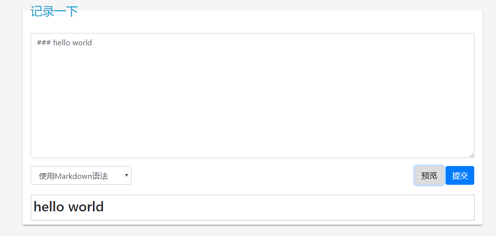

 note-axis
============

记事本,以时间轴呈现,记录某些代码片段,突然的灵感,一个句子等等

目前功能:
- 记录内容(可选解析markdown选项)
- 查找内容
- 按时间轴排序
- 流加载数据
- 需要登录可见
- 预览输入内容

Screenshots
------------
时间线

预览输入内容

Todo
------------
- [ ] 可修改某一天的内容
- [ ] 按日期分类
- [ ] 缓存
- [ ] 美化页面
- [x] 预览输入内容

